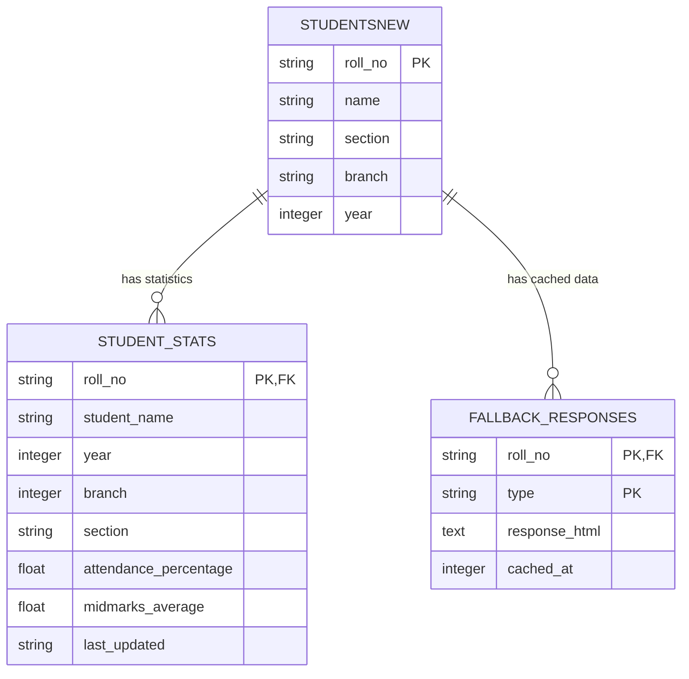

# Database Documentation

## Overview

NbkristQik uses **Turso** (libSQL/SQLite) as its primary database for storing student information and statistics. This document covers the schema, migrations, queries, and best practices.

**Database Provider:** Turso Cloud (https://turso.tech)  
**Client Library:** `@libsql/client`  
**Schema Version:** 1.0

---

## Connection

### Configuration

Database connection is configured via environment variables:

```bash
# .env
TURSO_DATABASE_URL=libsql://your-database.turso.io
TURSO_AUTH_TOKEN=your_auth_token_here
```

### Client Setup

```typescript
// src/db/db.ts
import { createClient } from "@libsql/client";

export const turso = createClient({
  url: process.env.TURSO_DATABASE_URL!,
  authToken: process.env.TURSO_AUTH_TOKEN!,
});
```

---

## Schema

### Tables

#### 1. `studentsnew`

Stores master student information.

```sql
CREATE TABLE studentsnew (
    roll_no TEXT PRIMARY KEY,
    name TEXT NOT NULL,
    section TEXT NOT NULL,
    branch TEXT NOT NULL,
    year INTEGER NOT NULL
);
```

**Columns:**

| Column | Type | Constraints | Description |
|--------|------|-------------|-------------|
| `roll_no` | TEXT | PRIMARY KEY | Student roll number (e.g., "21B81A05E9") |
| `name` | TEXT | NOT NULL | Full name in UPPERCASE |
| `section` | TEXT | NOT NULL | Section letter (A, B, C, etc.) |
| `branch` | TEXT | NOT NULL | Branch code as string |
| `year` | INTEGER | NOT NULL | Academic year (1, 2, 3, 4) |

**Example Data:**

```sql
INSERT INTO studentsnew VALUES 
  ('21B81A05E9', 'JOHN DOE', 'A', '5', 3),
  ('21B81A05F1', 'JANE SMITH', 'A', '5', 3),
  ('22B81A05A1', 'BOB JOHNSON', 'B', '5', 2);
```

**Indexes:**

```sql
-- Primary key index (automatic)
CREATE UNIQUE INDEX sqlite_autoindex_studentsnew_1 ON studentsnew(roll_no);
```

---

#### 2. `student_stats`

Stores aggregated statistics for leaderboard.

```sql
CREATE TABLE student_stats (
    roll_no TEXT PRIMARY KEY,
    student_name TEXT NOT NULL,
    year INTEGER NOT NULL,
    branch INTEGER NOT NULL,
    section TEXT NOT NULL,
    attendance_percentage REAL,
    midmarks_average REAL,
    last_updated TEXT NOT NULL,
    FOREIGN KEY (roll_no) REFERENCES studentsnew(roll_no)
);
```

**Columns:**

| Column | Type | Constraints | Description |
|--------|------|-------------|-------------|
| `roll_no` | TEXT | PRIMARY KEY, FK | References `studentsnew.roll_no` |
| `student_name` | TEXT | NOT NULL | Full name (denormalized for performance) |
| `year` | INTEGER | NOT NULL | Academic year |
| `branch` | INTEGER | NOT NULL | Branch code as integer |
| `section` | TEXT | NOT NULL | Section letter |
| `attendance_percentage` | REAL | NULL | Attendance % (0-100), null if not fetched |
| `midmarks_average` | REAL | NULL | Average midmarks (0-20), null if not fetched |
| `last_updated` | TEXT | NOT NULL | ISO 8601 timestamp of last update |

**Example Data:**

```sql
INSERT INTO student_stats VALUES 
  ('21B81A05E9', 'JOHN DOE', 3, 5, 'A', 95.50, 18.75, '2026-02-01T06:30:00.000Z'),
  ('21B81A05F1', 'JANE SMITH', 3, 5, 'A', 94.20, 19.00, '2026-02-01T06:25:00.000Z');
```

**Indexes:**

```sql
-- Performance indexes for leaderboard queries
CREATE INDEX idx_attendance ON student_stats(attendance_percentage DESC);
CREATE INDEX idx_midmarks ON student_stats(midmarks_average DESC);
CREATE INDEX idx_filters ON student_stats(year, branch, section);
CREATE INDEX idx_last_updated ON student_stats(last_updated DESC);
```

---

#### 3. `fallback_responses`

Stores HTML responses as fallback when Redis is unavailable.

```sql
CREATE TABLE fallback_responses (
    roll_no TEXT NOT NULL,
    type TEXT NOT NULL,
    response_html TEXT NOT NULL,
    cached_at INTEGER NOT NULL,
    PRIMARY KEY (roll_no, type)
);
```

**Columns:**

| Column | Type | Constraints | Description |
|--------|------|-------------|-------------|
| `roll_no` | TEXT | PRIMARY KEY (composite) | Student roll number |
| `type` | TEXT | PRIMARY KEY (composite) | Response type: `"attendance"` or `"midmarks"` |
| `response_html` | TEXT | NOT NULL | Raw HTML response from college portal |
| `cached_at` | INTEGER | NOT NULL | Unix timestamp (seconds) |

**Example Data:**

```sql
INSERT INTO fallback_responses VALUES 
  ('21B81A05E9', 'attendance', '<html>...</html>', 1738387200),
  ('21B81A05E9', 'midmarks', '<html>...</html>', 1738387200);
```

**Indexes:**

```sql
-- Composite primary key index (automatic)
CREATE UNIQUE INDEX sqlite_autoindex_fallback_responses_1 
  ON fallback_responses(roll_no, type);

-- Query by cached_at for cleanup
CREATE INDEX idx_fallback_cached_at ON fallback_responses(cached_at);
```

---

## Entity Relationships



---

## Queries

### Common Queries

#### Get Student by Roll Number

```typescript
// src/db/student.model.ts
export const getStudent = async (rollno: string) => {
  rollno = rollno.toUpperCase();

  const studentSet = await turso.execute({
    sql: `SELECT * FROM studentsnew WHERE roll_no = ?`,
    args: [rollno],
  });

  if (!studentSet.rows[0]) {
    throw new Error("Student not found");
  }

  return studentSet.rows[0] as Student;
};
```

#### Get Leaderboard with Filters

```typescript
// src/db/student_stats.model.ts
export const getLeaderboard = async (
  sortBy: "attendance" | "midmarks",
  limit: number,
  offset: number,
  filters: { year?: string; branch?: string; section?: string }
) => {
  const orderColumn = sortBy === "attendance" 
    ? "attendance_percentage" 
    : "midmarks_average";

  let whereClauses: string[] = [];
  let args: any[] = [];

  if (filters.year && filters.year !== "all") {
    whereClauses.push("year = ?");
    args.push(parseInt(filters.year));
  }

  if (filters.branch && filters.branch !== "all") {
    whereClauses.push("branch = ?");
    args.push(parseInt(filters.branch));
  }

  if (filters.section && filters.section !== "all") {
    whereClauses.push("section = ?");
    args.push(filters.section.toUpperCase());
  }

  const whereClause = whereClauses.length > 0
    ? `WHERE ${whereClauses.join(" AND ")}`
    : "";

  const sql = `
    SELECT * FROM student_stats
    ${whereClause}
    ORDER BY ${orderColumn} DESC NULLS LAST
    LIMIT ? OFFSET ?
  `;

  args.push(limit, offset);

  const result = await turso.execute({ sql, args });
  return result.rows as StudentStats[];
};
```

#### Store Fallback Response

```typescript
export const storeResponse = async (
  rollno: string,
  type: "attendance" | "midmarks",
  html: string
) => {
  const now = Math.floor(Date.now() / 1000);
  
  await turso.execute({
    sql: `
      INSERT INTO fallback_responses (roll_no, type, response_html, cached_at)
      VALUES (?, ?, ?, ?)
      ON CONFLICT(roll_no, type) DO UPDATE SET
        response_html = excluded.response_html,
        cached_at = excluded.cached_at
    `,
    args: [rollno.toUpperCase(), type, html, now],
  });
};
```

#### Get Fallback Response

```typescript
export const getResponse = async (
  rollno: string,
  type: "attendance" | "midmarks"
) => {
  const result = await turso.execute({
    sql: `
      SELECT response_html, cached_at
      FROM fallback_responses
      WHERE roll_no = ? AND type = ?
    `,
    args: [rollno.toUpperCase(), type],
  });

  if (!result.rows[0]) {
    return null;
  }

  return {
    html: result.rows[0].response_html as string,
    cachedAt: result.rows[0].cached_at as number,
  };
};
```

#### Update Student Stats

```typescript
export const updateStudentStats = async (
  rollno: string,
  stats: {
    attendancePercentage?: number;
    midmarksAverage?: number;
  }
) => {
  const student = await getStudent(rollno);
  const now = new Date().toISOString();

  const updates: string[] = [];
  const args: any[] = [];

  if (stats.attendancePercentage !== undefined) {
    updates.push("attendance_percentage = ?");
    args.push(stats.attendancePercentage);
  }

  if (stats.midmarksAverage !== undefined) {
    updates.push("midmarks_average = ?");
    args.push(stats.midmarksAverage);
  }

  updates.push("last_updated = ?");
  args.push(now);

  args.push(rollno);

  await turso.execute({
    sql: `
      INSERT INTO student_stats (
        roll_no, student_name, year, branch, section,
        attendance_percentage, midmarks_average, last_updated
      )
      VALUES (?, ?, ?, ?, ?, ?, ?, ?)
      ON CONFLICT(roll_no) DO UPDATE SET
        ${updates.join(", ")}
    `,
    args: [
      rollno,
      student.name,
      student.year,
      parseInt(student.branch),
      student.section,
      stats.attendancePercentage ?? null,
      stats.midmarksAverage ?? null,
      now,
    ],
  });
};
```

---

## Migrations

### Initial Schema Setup

```sql
-- Run this to create all tables from scratch

-- 1. Create studentsnew table
CREATE TABLE IF NOT EXISTS studentsnew (
    roll_no TEXT PRIMARY KEY,
    name TEXT NOT NULL,
    section TEXT NOT NULL,
    branch TEXT NOT NULL,
    year INTEGER NOT NULL
);

-- 2. Create student_stats table
CREATE TABLE IF NOT EXISTS student_stats (
    roll_no TEXT PRIMARY KEY,
    student_name TEXT NOT NULL,
    year INTEGER NOT NULL,
    branch INTEGER NOT NULL,
    section TEXT NOT NULL,
    attendance_percentage REAL,
    midmarks_average REAL,
    last_updated TEXT NOT NULL,
    FOREIGN KEY (roll_no) REFERENCES studentsnew(roll_no)
);

-- 3. Create indexes for student_stats
CREATE INDEX IF NOT EXISTS idx_attendance 
  ON student_stats(attendance_percentage DESC);
  
CREATE INDEX IF NOT EXISTS idx_midmarks 
  ON student_stats(midmarks_average DESC);
  
CREATE INDEX IF NOT EXISTS idx_filters 
  ON student_stats(year, branch, section);
  
CREATE INDEX IF NOT EXISTS idx_last_updated 
  ON student_stats(last_updated DESC);

-- 4. Create fallback_responses table
CREATE TABLE IF NOT EXISTS fallback_responses (
    roll_no TEXT NOT NULL,
    type TEXT NOT NULL,
    response_html TEXT NOT NULL,
    cached_at INTEGER NOT NULL,
    PRIMARY KEY (roll_no, type)
);

-- 5. Create index for fallback cleanup
CREATE INDEX IF NOT EXISTS idx_fallback_cached_at 
  ON fallback_responses(cached_at);
```

### Running Migrations

**Using Turso CLI:**

```bash
# Install Turso CLI
curl -sSfL https://get.tur.so/install.sh | bash

# Login
turso auth login

# Create database
turso db create nbkristqik

# Get connection details
turso db show nbkristqik

# Execute migration
turso db shell nbkristqik < migrations/001_initial_schema.sql
```

**Using Node.js script:**

```typescript
// scripts/migrate.ts
import { turso } from "../src/db/db.js";
import fs from "fs";

async function runMigration(file: string) {
  const sql = fs.readFileSync(file, "utf-8");
  const statements = sql
    .split(";")
    .map(s => s.trim())
    .filter(s => s.length > 0);

  for (const statement of statements) {
    await turso.execute(statement);
    console.log(`✓ Executed: ${statement.substring(0, 50)}...`);
  }
}

await runMigration("migrations/001_initial_schema.sql");
console.log("✓ Migration complete");
```

---

## Data Import

### Import Student Data

```typescript
// scripts/import-students.ts
import { turso } from "../src/db/db.js";
import fs from "fs";

interface StudentCSV {
  roll_no: string;
  name: string;
  section: string;
  branch: string;
  year: number;
}

async function importStudents(csvFile: string) {
  const data = fs.readFileSync(csvFile, "utf-8");
  const lines = data.split("\n").slice(1); // Skip header

  for (const line of lines) {
    const [roll_no, name, section, branch, year] = line.split(",");
    
    await turso.execute({
      sql: `
        INSERT INTO studentsnew (roll_no, name, section, branch, year)
        VALUES (?, ?, ?, ?, ?)
        ON CONFLICT(roll_no) DO UPDATE SET
          name = excluded.name,
          section = excluded.section,
          branch = excluded.branch,
          year = excluded.year
      `,
      args: [
        roll_no.trim().toUpperCase(),
        name.trim().toUpperCase(),
        section.trim().toUpperCase(),
        branch.trim(),
        parseInt(year.trim()),
      ],
    });
  }

  console.log(`✓ Imported ${lines.length} students`);
}

await importStudents("data/students.csv");
```

**CSV Format:**

```csv
roll_no,name,section,branch,year
21B81A05E9,JOHN DOE,A,5,3
21B81A05F1,JANE SMITH,A,5,3
22B81A05A1,BOB JOHNSON,B,5,2
```

---

## Maintenance

### Cleanup Old Fallback Responses

```sql
-- Delete responses older than 7 days
DELETE FROM fallback_responses
WHERE cached_at < (strftime('%s', 'now') - 604800);
```

```typescript
// Automated cleanup script
export async function cleanupOldResponses(daysOld: number = 7) {
  const cutoffTime = Math.floor(Date.now() / 1000) - (daysOld * 86400);
  
  const result = await turso.execute({
    sql: "DELETE FROM fallback_responses WHERE cached_at < ?",
    args: [cutoffTime],
  });

  console.log(`✓ Deleted ${result.rowsAffected} old responses`);
}
```

### Vacuum Database

```sql
-- Reclaim unused space
VACUUM;
```

### Analyze Query Performance

```sql
-- Explain query plan
EXPLAIN QUERY PLAN
SELECT * FROM student_stats
WHERE year = 3 AND branch = 5
ORDER BY attendance_percentage DESC
LIMIT 50;
```

---

## Backup & Restore

### Manual Backup

```bash
# Using Turso CLI
turso db dump nbkristqik > backup_$(date +%Y%m%d).sql
```

### Automated Backups

Turso provides automatic daily backups. Configure retention:

```bash
turso db update nbkristqik --backup-retention-days 30
```

### Restore from Backup

```bash
# Create new database from backup
turso db create nbkristqik-restored --from-dump backup_20260201.sql
```

---

## Performance Optimization

### Index Usage

Always use indexes for:
- Sorting (attendance, midmarks)
- Filtering (year, branch, section)
- Lookups (roll_no)

### Query Tips

**✅ Good:**
```sql
-- Uses index
SELECT * FROM student_stats
WHERE year = 3 AND branch = 5
ORDER BY attendance_percentage DESC
LIMIT 50;
```

**❌ Bad:**
```sql
-- Full table scan
SELECT * FROM student_stats
WHERE LOWER(section) = 'a';  -- Don't use functions on indexed columns
```

### Connection Pooling

Turso client handles connection pooling automatically. For high-traffic scenarios, consider:

```typescript
// Reuse single client instance
export const turso = createClient({
  url: process.env.TURSO_DATABASE_URL!,
  authToken: process.env.TURSO_AUTH_TOKEN!,
});
```

---

## Troubleshooting

### Common Issues

**"Student not found" error:**
- Verify roll number format (uppercase, correct pattern)
- Check if student exists: `SELECT * FROM studentsnew WHERE roll_no = 'XXX'`

**Slow queries:**
- Run `EXPLAIN QUERY PLAN` to check index usage
- Verify indexes exist: `.indexes student_stats`
- Consider adding missing indexes

**Foreign key constraint errors:**
- Ensure parent record exists in `studentsnew` before inserting into `student_stats`
- Use `ON CONFLICT` to handle duplicates

**Connection errors:**
- Verify `TURSO_DATABASE_URL` and `TURSO_AUTH_TOKEN` are set
- Check Turso dashboard for database status
- Test connection: `turso db shell nbkristqik`

---

## Best Practices

### 1. Always Normalize Roll Numbers
```typescript
rollno = rollno.toUpperCase().trim();
```

### 2. Use Parameterized Queries
```typescript
// ✅ Good (prevents SQL injection)
await turso.execute({
  sql: "SELECT * FROM studentsnew WHERE roll_no = ?",
  args: [rollno],
});

// ❌ Bad
await turso.execute(`SELECT * FROM studentsnew WHERE roll_no = '${rollno}'`);
```

### 3. Handle Nulls Gracefully
```typescript
const percentage = stats.attendance_percentage ?? 0;
```

### 4. Use Transactions for Multiple Operations
```typescript
await turso.batch([
  { sql: "INSERT INTO ...", args: [...] },
  { sql: "UPDATE ...", args: [...] },
]);
```

### 5. Log Slow Queries
```typescript
const start = Date.now();
const result = await turso.execute(query);
const duration = Date.now() - start;

if (duration > 100) {
  console.warn(`Slow query (${duration}ms):`, query);
}
```

---

## Future Enhancements

### Planned Schema Changes

1. **Add timestamps to studentsnew:**
```sql
ALTER TABLE studentsnew ADD COLUMN created_at TEXT DEFAULT (datetime('now'));
ALTER TABLE studentsnew ADD COLUMN updated_at TEXT DEFAULT (datetime('now'));
```

2. **Track attendance history:**
```sql
CREATE TABLE attendance_history (
  id INTEGER PRIMARY KEY AUTOINCREMENT,
  roll_no TEXT NOT NULL,
  date TEXT NOT NULL,
  percentage REAL NOT NULL,
  recorded_at TEXT DEFAULT (datetime('now')),
  FOREIGN KEY (roll_no) REFERENCES studentsnew(roll_no)
);
```

3. **Add user preferences:**
```sql
CREATE TABLE user_preferences (
  roll_no TEXT PRIMARY KEY,
  notification_enabled BOOLEAN DEFAULT 1,
  threshold_percentage REAL DEFAULT 75.0,
  FOREIGN KEY (roll_no) REFERENCES studentsnew(roll_no)
);
```

---

*Last Updated: February 1, 2026*
